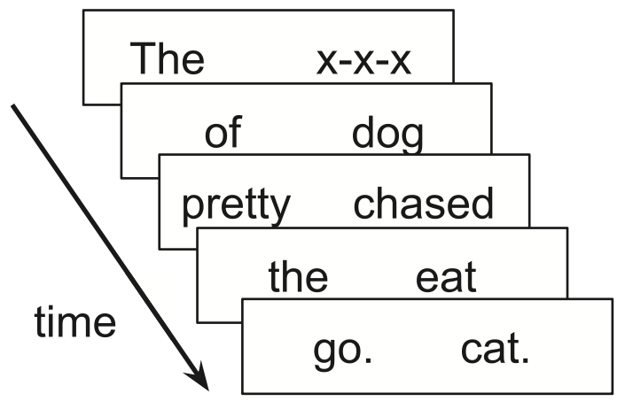

```{r setup, include=FALSE}
library(MASS) # make sure to call this before library(tidyverse) as they both have select()
knitr::opts_chunk$set(echo = FALSE)
library(tidyverse)
library(ggplot2)
library(latex2exp)
theme_set(theme_bw())
theme_set(theme(text=element_text(size=20), #change font size of all text
        axis.text=element_text(size=20), #change font size of axis text
        axis.title=element_text(size=20), #change font size of axis titles
        plot.title=element_text(size=20), #change font size of plot title
        legend.text=element_text(size=20), #change font size of legend text
        legend.title=element_text(size=20))) #change font size of legend title
library(stringr)
library(brms)
library(rstan)
library(gtools)
options(knitr.table.format = "html")
library(knitr)
library(lme4)
library(xtable)
```

## Motivation and goal of today's meeting

* Error bars (and the like) are key parts of scientific visualization
* They are used to convey variability or uncertainty in data or models
* You should use them whenever there is visual room for them
* However, there is no unique "right" way to construct error bars
* We will discuss good scientific practice in align your choices about error bars with audience expectations and understanding 


## A simple example 

Boyce et al. (2020) investigated how well the Maze task captures incremental syntactic disambiguation effects in comprehension.

<center> {#id .class width=50% height=50%} </center>

Getting a word wrong ends the trial. The reaction time (RT) in choosing the critical word in the sentence is the dependent measure.

## Example sentence contrast {.build}

* The uncle of the waitress who hurt **herself** was shocked by the accident.

vs

* The uncle of the waitress who hurt **himself** was shocked by the accident.

Previous work has shown a **low attachment** preference (i.e., the relative clause *who...* modifying the more recent noun) in English.

Following Witzel et al. (2012), Boyce et al. had 46 participants (after exclusions) each read one or the other versions of this sentence in the Maze task -- not all participants made it through to the critical word without making a mistake, so there are 25 measurements remaining in the dataset.


## Results {.build}

```{r, cache=TRUE}
process_data <- function(source){
  #source = .rds file location of data
  #returns tibble of data after participant removal, and with only correct answers
  data <- read_rds(source)
  data_filtered <- data %>% 
  filter(citizen=="yes" & native=="yes" & resident=="yes")

message("Removed ", format(100-100*nrow(data_filtered)/nrow(data), digits=2), "% participants who are not citizens, native speakers, or residents of the US.")

message("We have ", length(unique(data_filtered$subject)), " participants left.")

#filter out and adjust bad data points

#remove na points that participants didn't see
data_no_na<- data_filtered %>% 
  filter(!(is.na(rt)))
  

message("Removed ", format(100-100*nrow(data_no_na)/nrow(data_filtered), digits=2), "% of the data for being na (after a mistake).")

#remove mistakes
 data_cleaned <- data_no_na %>% 
   filter(correct=="yes") %>% 
   select(-correct)

message("Removed ", format(100-100*nrow(data_cleaned)/nrow(data_no_na), digits=2), "% of the data for not having correct answer.")

message(format(100*nrow(data_cleaned)/nrow(data_filtered), digits=2), "% of possible data is left" )
data_no_0 <-  data_cleaned %>% 
  filter(rt!=0)

message("Removed ", format(100-100*nrow(data_no_0)/nrow(data_cleaned), digits=2), "% of the data for having a RT of 0.")

data_no_0
}

for_model <- function(data, type){ # copied from Maze/experiment/Code/results.Rmd
  #data is tibble of data (output of process_data), type is "rel", "adv", or "noun"

rel_labelled <- read_rds("../Labelled/rel_clause_labelled.rds")
adv_labelled <- read_rds("../Labelled/adv_clause_labelled.rds")
noun_labelled <- read_rds("../Labelled/noun_clause_labelled.rds")

if(type=="rel"){
data_rel <- data %>% 
  filter(type=="relative_high"| type=="relative_low") %>% 
  left_join(rel_labelled, by=c("word_num", "sentence", "type", "word", "group"="item_num")) %>% 
   mutate(item.factor=as.factor(group),
         type.numeric=ifelse(type=="relative_low", 0, 1)) #treatment code expected as 0, unusual as 1

return(data_rel)}

if(type=="adv"){
data_adv<- data %>% 
  filter(type=="adverb_high"|type=="adverb_low") %>% 
  left_join(adv_labelled, by=c("word_num", "sentence", "type", "word", "group"="item_num")) %>% 
  mutate(mod_word_number=ifelse(multi_word=="yes"&mod_word_number>0, mod_word_number-1, mod_word_number)) %>% 
  group_by(subject, group, mod_word_number, type) %>% 
  summarize(rt=mean(rt)) %>% 
  mutate(item.factor=as.factor(group),
         type.numeric=ifelse(type=="adverb_low", 0, 1)) #treatment code expected as 0, unusual as 1

return(data_adv)}
if(type=="noun"){
data_noun <- data%>% 
  filter(type=="and_no_comma"|type=="and_comma") %>% 
  left_join(noun_labelled, by=c("word_num", "sentence", "type", "word", "group"="item_num")) %>% 
   mutate(item.factor=as.factor(group),
         type.numeric=ifelse(type=="and_comma", 0, 1)) #treatment code expected as 0, unusual as 1

return(data_noun)
}

}
```

```{r, message=F}
setwd("/Users/rlevy/ling/repos/Maze/experiment/Code")
#source("/Users/rlevy/ling/repos/Maze/experiment/Code/read_results.R")
#dat <- read_csv("/Users/rlevy/ling/repos/Maze/experiment/Data/Raw/gulo_raw")
dat <- process_data("../Data/Processed/gulo_maze.rds") %>%
  for_model("rel") %>%
  filter(mod_word_number==0) %>%
  mutate(Type=ifelse(type=="relative_high", "High attachment","Low attachment")) %>%
  mutate(Item=as.numeric(item.factor),Subject=as.numeric(subject))
dat1 <- filter(dat,as.numeric(subject) < 21)
dd <- dat1 %>% 
  group_by(Type) %>%
  summarize(RT=mean(rt),SE=se(rt),SD=sd(rt))
my_dodge <- position_dodge(0.1)
```

```{r}
dat_oneitem<- filter(dat,Item==3)
oneitem_means <- dat_oneitem %>%
  group_by(Type) %>%
  summarize(RT=mean(rt),SE=se(rt))
#print(as.data.frame(oneitem_means))
#print(t.test(filter(dat_oneitem,Type=="High attachment")$rt,filter(dat_oneitem,Type=="Low attachment")$rt))
#print(dat_oneitem$sentence)
```
```{r}
ggplot(oneitem_means,aes(x=Type,y=RT)) +
  geom_bar(stat="identity",position=my_dodge) +
    ylim(c(0,1800)) +
    ylab("Mean RT")
```


Before I go on: *what do you expect error bars to convey?*


## Results (with error bars) {.build .smaller}

```{r out.height="80%",out.width="80%",sd}
dat_to_plot <- dat_oneitem %>% group_by(Type) %>% 
### <b>
  summarize(RT=mean(rt),SD=sd(rt),SE=se(rt))
### </b>
ggplot(dat_to_plot,aes(x=Type,y=RT)) + 
  geom_bar(stat="identity",position=my_dodge) +
  ylim(c(0,1800)) +
  geom_errorbar(aes(ymin=RT-SD,ymax=RT+SD),width=0.2,position=my_dodge)
```

* These error bars happen to depict the **standard deviation of the sample**
* If you collected twice as much data, the standard deviation of the resulting sample would **probably be about the same**

## Standard deviation vs standard error {.build .smaller}

Unbiased estimate of population standard deviation: $$s=\left[\frac{1}{N-1} \sum_{i=1}^N (x_i - \bar{x})^2\right]^{\frac{1}{2}}$$

Standard error of the mean: $$s/\sqrt{N}$$

```{r out.width = "50%", out.height = "50%"}
ggplot(dat_to_plot,aes(x=Type,y=RT)) + 
  geom_bar(stat="identity",position=my_dodge) +
  geom_errorbar(aes(ymin=RT-SD,ymax=RT+SD),width=0.2,position=my_dodge) +
  ylim(c(0,1800)) +
  ggtitle("Standard deviation")
ggplot(dat_to_plot,aes(x=Type,y=RT)) + 
  geom_bar(stat="identity",position=my_dodge) +
  geom_errorbar(aes(ymin=RT-SE,ymax=RT+SE),width=0.2,position=my_dodge) +
  ylim(c(0,1800)) +
  ggtitle("Standard error")
```

In this example, N is `r nrow(filter(dat_oneitem,Type=="High attachment"))` for high attachment sentences and `r nrow(filter(dat_oneitem,Type=="Low attachment"))` for low attachment sentences. Collecting more data would *shrink* the standard error.


## Conveying uncertainty about the population mean

* Standard error of the mean = **standard deviation of the estimate of the population mean**
* That is: if you repeatedly collected a size-N sample from a normally distributed, it's the standard deviation of the resulting distribution of sample means
* So the standard error of the mean quantifies **uncertainty in the population mean given the data at hand**
* That is **one thing** audiences expect of confidence intervals, and one thing you can thus use them to convey.

## A bit more: 95% confidence intervals {.build .smaller}

* Central Limit Theorem: the mean of **independent, identically distributed** (iid) random variables tends toward a normal distribution with std deviation equal to the standard error
* Mean ± 1.96 times  standard error bounds a symmetric 95% (frequentist) confidence interval on the normal distribution
* With uniform priors, Bayesian confidence intervals (aka **credible intervals**) on the population mean would look generally the same (not shown)

```{r out.width = "50%", out.height = "50%"}
ggplot(dat_to_plot,aes(x=Type,y=RT)) + 
  geom_bar(stat="identity",position=my_dodge) +
  geom_errorbar(aes(ymin=RT-SE,ymax=RT+SE),width=0.2,position=my_dodge) +
  ylim(c(0,1800)) +
  ggtitle("Standard error")
ggplot(dat_to_plot,aes(x=Type,y=RT)) + 
  geom_bar(stat="identity",position=my_dodge) +
  geom_errorbar(aes(ymin=RT-1.96*SE,ymax=RT+1.96*SE),width=0.2,position=my_dodge) +
  ylim(c(0,1800)) +
  ggtitle(TeX("1.96 $\\times$ Standard error"))
```

(Note that ±1.96 times isn't exact due to finite sample size, but it's reasonably close except when there are very few observations)

## Strength of evidence for differences in condition means? {.build .smaller}

* Common faulty inference: using error bar overlap to assess evidence for difference in condition means
* If (1-α)% confidence intervals do **not** overlap for two conditions, it is a **sufficient** condition to conclude with (1-α)% confidence that the underlying means **are different**
  - This is most easily seen for Bayesian confidence intervals
* But it is **not** a **necessary** condition!
* Example: paired samples drawn from 

$$\text{Normal}\left(\mu=\langle 0.5,0\rangle,\Sigma=\left[\begin{matrix} 1 & 0.5 \\ 0.5 & 1\end{matrix}\right]\right)$$

* Think of each 2D sample as a different subject's response measure in two different experimental conditions


## Overlapping CIs != strength of evidence for differing means {.build}

In the below, boxes indicate condition means & 95% CIs:

```{r}
set.seed(18)
Sigma <- matrix(c(1,0.5,0.5,1),2,2)
mu <- c(0.5,0)
N <- 20
x <- mvrnorm(N,mu,Sigma)
X <- data.frame(Condition=rep(c("A","B"),each=N),replicate=factor(rep(1:N,2)),Y=c(x[,1],x[,2])) %>%
  mutate(x=ifelse(Condition=="A",1,2))
#t.test(x[,1],x[,2],paired=TRUE)
summary_stats <- data.frame(Condition=factor(c("A","B")),Mean=c(apply(x,2,mean)),SE=c(apply(x,2,se)))
```

```{r, out.height="70%", out.width="70%"}
mean_95ci <- function(x) {
   m <- mean(x)
   ymin <- m-1.96*se(x)
   ymax <- m+1.86*se(x)
   return(c(y=m,ymin=ymin,ymax=ymax))
}
ggplot(X,aes(x=Condition,y=Y,color=Condition)) + 
  geom_violin() +
  geom_point() +
  stat_summary(fun.data=mean_95ci,geom="crossbar",width=0.2)
  #geom_bar(stat="identity",position=my_dodge)# +
  #geom_errorbar(aes(ymin=summary_stats$Mean-1.96*summary_stats$SE,ymax=summary_stats$Mean+1.96*summary_stats$SE),width=0.2,position=my_dodge) +
  #ggtitle(TeX("1.96 $\\times$ Standard error"))
```

* Boxes overlap, but a paired t-test shows p=`r round(t.test(x[,1],x[,2],paired=TRUE)$p.value,3)`! How???

## Visualizing

A "spaghetti plot" is revealing: the direction of the A/B contrast is highly consistent within replicate!

```{r warning=F,message=F,out.height="70%",out.width="70%"}
ggplot(X,aes(x=x,y=Y,color=replicate)) + 
  geom_point() +
  geom_line() +
  scale_x_discrete("Condition", c(1,2), c("A","B"), c(1,2)) +
  theme(legend.position="none")
```

These within-replicate relationships are taken into account by the paired t-test **but not the error bars as I chose to draw them**

## If the data were not paired...

Here are the exact same data with the pairings scrambled:

```{r warning=F,message=F,out.height="70%",out.width="70%"}
set.seed(1)
X1 <- X
X1$Y[1:N] <- X1$Y[sample(1:N)]
ggplot(X1,aes(x=x,y=Y,color=replicate)) + 
  geom_point() +
  geom_line() +
  scale_x_discrete("Condition", c(1,2), c("A","B"), c(1,2)) +
  theme(legend.position="none")
```


* A paired t-test on these data shows p=`r round(t.test(X1$Y[1:N],X1$Y[(N+1):(2*N)],paired=TRUE)$p.value,3)`
* The error bars I drew convey uncertainty in the condition means **but not the coupling of that uncertainty across conditions**

## "Within-group" confidence intervals {.smaller}

* Loftus & Masson (1994) argued that "because between-subject variance typically plays no role in statistical analyses of within-subject designs, it can legitimately be ignored" in constructing confidence intervals
* Their suggested confidence interval is equivalent to the following procedure:
  - subtract out each subject's mean from that subject's data in all conditions
  - compute confidence interval widths for each condition
  - attach those confidence intervals to the original condition means
* Result:
  
```{r fig.height=3.5,out.height="50%", out.width="50%", warning=F}
replicate_means <- with(X,tapply(Y,replicate,mean))
X$Y_adjusted <- X$Y - replicate_means[X$replicate]
X_summary_stats <- X %>%
  group_by(Condition) %>%
  summarize(Mean=mean(Y),SE=se(Y),SE_loftus_masson=se(Y_adjusted))
ggplot(X_summary_stats,aes(x=Condition,y=Mean)) +
  geom_bar(stat="identity",position=my_dodge) +
  geom_errorbar(ymin=X_summary_stats$Mean-1.96*X_summary_stats$SE,ymax=X_summary_stats$Mean+1.96*X_summary_stats$SE,width=0.2,position=my_dodge) +
  ylim(c(-1,1.5)) +
  ggtitle("Standard 95% CIs")
ggplot(X_summary_stats,aes(x=Condition,y=Mean)) +
  geom_bar(stat="identity",position=my_dodge) +
  geom_errorbar(ymin=X_summary_stats$Mean-1.96*X_summary_stats$SE_loftus_masson,ymax=X_summary_stats$Mean+1.96*X_summary_stats$SE_loftus_masson,width=0.2,position=my_dodge) +
  ylim(c(-1,1.5)) +
  ggtitle("Loftus & Masson 95% CIs")
```

* Bonus result: the confidence interval on the difference between sample means is `sqrt(2)` times the size of this Loftus & Masson confidence interval

## More issues with repeated measures {.smaller}

Back to Boyce et al (2020): actually there were 24 items (sentence pairs), each read in one of the two conditions by each of the 46 participants, so our observations have **repeated measures** within both subjects and items - a sample of the dataset:

```{r }
dat_subset <- filter(dat,Subject %in% c(2,4,14),Item %in% c(1,4,24)) %>%
  select(Subject,Item,Type,word,rt)
print(as.data.frame(dat_subset))
```

A couple more example items -- notice the potential for item effects:

* The sister of the salesman who made a fool of herself/himself at work was very angry.
* The nephew of the queen who praised himself/herself all the time was very rude.


This means that our observations are **not** iid and therefore naive standard errors and confidence intervals would be **invalid**!

## By-group data aggregation {.smaller}


```{r, echo=TRUE, warning=FALSE, message=FALSE}
dat_by_subject <- dat_subset %>% 
  group_by(Subject,Type) %>%
  summarize(rt=mean(rt))
```

```{r}
print(as.data.frame(dat_by_subject))
```

```{r, echo=TRUE, warning=FALSE, message=FALSE}
summary_stats <- dat_by_subject %>%
  group_by(Type) %>%
  summarize(RT=mean(rt),SE=se(rt))
```

```{r}
print(as.data.frame(summary_stats))
```


## By-group data aggregation {.smaller}

```{r message=FALSE}
dat_summarized <- dat %>%
  group_by(Type) %>%
  summarize(RT=mean(rt),SE=se(rt))
dat_by_subject_summarized <- dat %>%
  group_by(Subject,Type) %>%
  summarize(rt=mean(rt)) %>%
  group_by(Type) %>%
  summarize(RT=mean(rt),SE=se(rt))
dat_by_item_summarized <- dat %>%
  group_by(Item,Type) %>%
  summarize(rt=mean(rt)) %>%
  group_by(Type) %>%
  summarize(RT=mean(rt),SE=se(rt))
```

Raw means & standard errors:

```{r message=FALSE}
print(as.data.frame(dat_summarized))
```

By subjects:

```{r}
print(as.data.frame(dat_by_subject_summarized))
```

By items:
```{r}
print(as.data.frame(dat_by_item_summarized))
```

## By-group data aggregation 

```{r warning=F,out.height="50%",out.width="50%"}
ggplot(dat_summarized,aes(x=Type,y=RT)) +
  geom_bar(stat="identity",position=my_dodge) +
  geom_errorbar(ymin=dat_summarized$RT-1.96*dat_summarized$SE,ymax=dat_summarized$RT+1.96*dat_summarized$SE,width=0.2,position=my_dodge) +
  ylim(c(0,1200)) +
  ggtitle("Raw means and 95% CIs (invalid)")
ggplot(dat_by_subject_summarized,aes(x=Type,y=RT)) +
  geom_bar(stat="identity",position=my_dodge) +
  geom_errorbar(ymin=dat_by_subject_summarized$RT-1.96*dat_by_subject_summarized$SE,ymax=dat_by_subject_summarized$RT+1.96*dat_by_subject_summarized$SE,width=0.2,position=my_dodge) +
  ylim(c(0,1200)) +
  ggtitle("By-subject means and 95% CIs (less invalid)")
ggplot(dat_by_item_summarized,aes(x=Type,y=RT)) +
  geom_bar(stat="identity",position=my_dodge) +
  geom_errorbar(ymin=dat_by_item_summarized$RT-1.96*dat_by_item_summarized$SE,ymax=dat_by_item_summarized$RT+1.96*dat_by_item_summarized$SE,width=0.2,position=my_dodge) +
  ylim(c(0,1200)) +
  ggtitle("By-item means and 95% CIs (less invalid)")
```

```{r warning=F, message=F}
m <- lmer(rt ~ 0 + Type + (0 + Type|subject) + (0 + Type|item.factor),dat,REML=F)
```

## Mixed-effects models can help! {.smaller}

Dummy-coding conditions (two 0/1 vars) gives uncertainty about condition means:

```{r warning=F, message=F}
summary(m)
```

## Mixed-effects models can help! {.smaller}

Sum-coding condition (±1) gives uncertainty about condition differences:

```{r warning=F,message=F}
dat$TypeSum <- ifelse(dat$Type=="High attachment",1,-1)
m <- lmer(rt ~ TypeSum + (TypeSum|subject) + (TypeSum|item.factor),dat,REML=F)
```

```{r}
summary(m)
```

## Takeaways {.smaller}

* Error bars are a visualization tool that scientific audiences are familiar with -- **use them**!
* However, there are many ways to use them.
  - Think carefully about **what you want them to convey**; and
  - **Be clear about how you are using them.**
* I tend to think that error bars are usually best suited for conveying **uncertainty about summary statistics, very often the mean or expected value**
  - There are other options, such as density plots, for conveying variability in the data distribution
* Regardless: for even the simplest data, your choices about error bars imply an implicit assumed generative model and a focus on particular quantities in that model
* Sometimes, fitting a model is the best way to accurately quantify the uncertainty you want to convey.

## Thanks!!!
